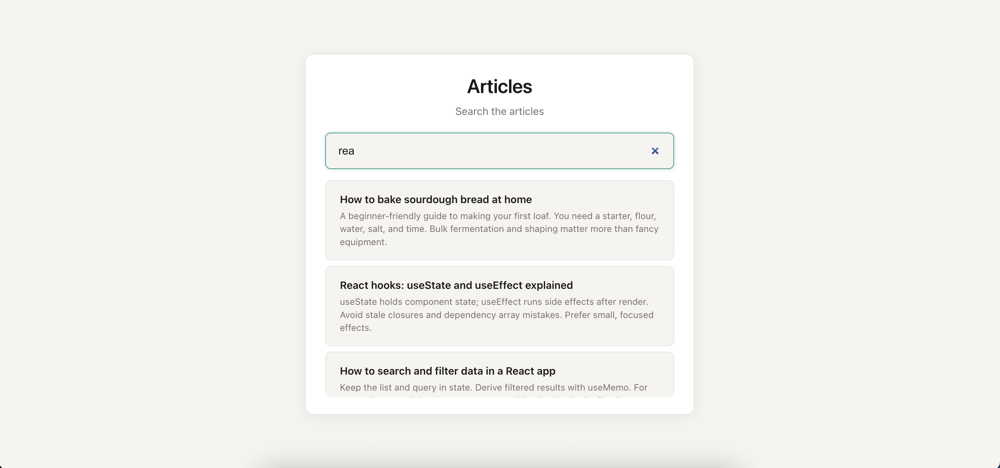

# Articles Search

A React and TypeScript article search interface that fetches results from an existing REST API using debounced search.

This project was developed from an existing starter codebase. My work focused on implementing debouncing, replacing the mock data flow with real API requests, and organizing the frontend data-fetching logic.

## Preview



## My Implementation

- Implemented a reusable `debounce` function in pure JavaScript
- Created a custom React `useDebounce` hook
- Replaced mock article data with real API requests
- Connected the search input to the provided articles API
- Used a configurable `VITE_API_URL` instead of hardcoding the backend URL
- Applied debouncing to avoid unnecessary API requests while typing
- Preserved loading and empty-result states when integrating the API
- Refactored the articles feature into separate component, hook, and service responsibilities
- Added the CORS configuration required for frontend-backend communication

## How the Search Works

The search input is debounced by `500ms`.

Once the user stops typing, the debounced value is used to request matching articles from the API. This avoids sending a new request on every keystroke while keeping the search experience responsive.

## Tech Stack

**Frontend**
- React
- TypeScript
- JavaScript
- Vite

**Integration**
- REST API
- Fetch API

> The backend and the initial UI structure and styling were provided as part of the starter codebase.

## Project Structure

```text
articles-search-app/
├── ui/             React frontend
├── backend/        Provided backend API
├── homework.md     Original exercise requirements
└── README.md
```

## Getting Started

### Requirements

Tested on:

- macOS / Linux
- Node.js 18+
- npm

### Install dependencies

From the repository root:

`npm install`

### Initialize the provided backend

Create the SQLite database and articles table:

`npm run db:push -w backend`

Seed the database with the provided sample articles:

`npm run db:reset -w backend`

### Run the application

Start the backend:

`npm run dev:backend`

In a separate terminal, start the frontend:

`npm run dev:ui`

By default:
- Frontend: `http://localhost:5173`
- Backend: `http://localhost:3001`

## Original Exercise

The original requirements are available in [homework.md](./homework.md).
